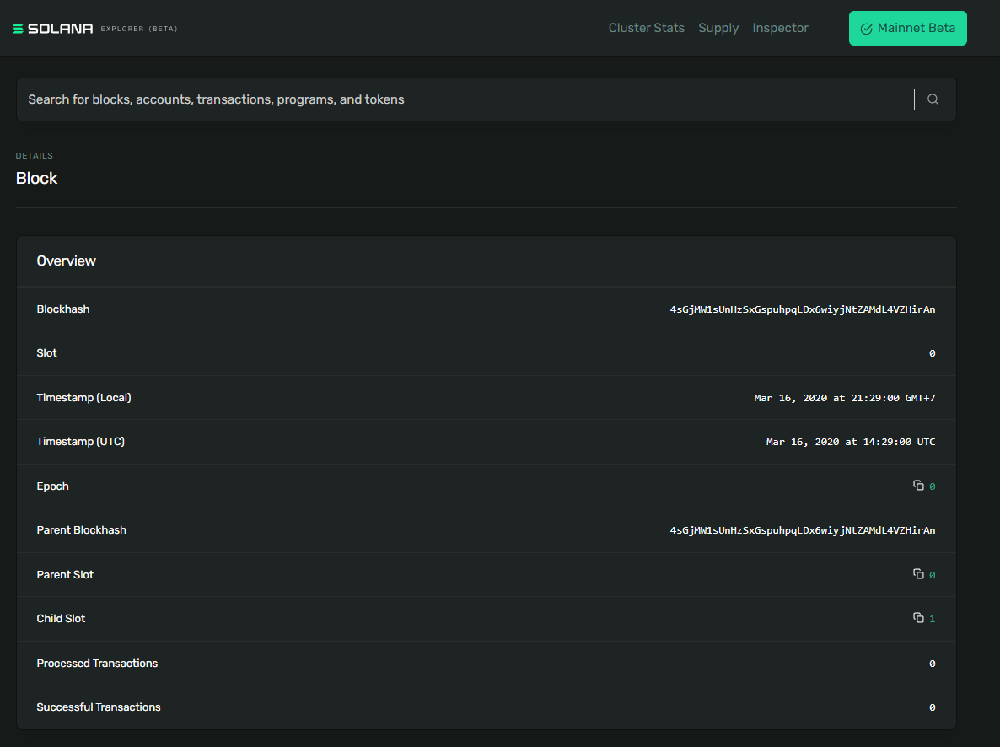
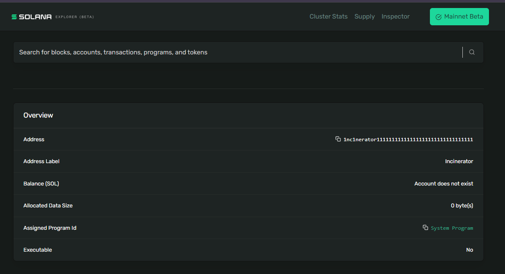
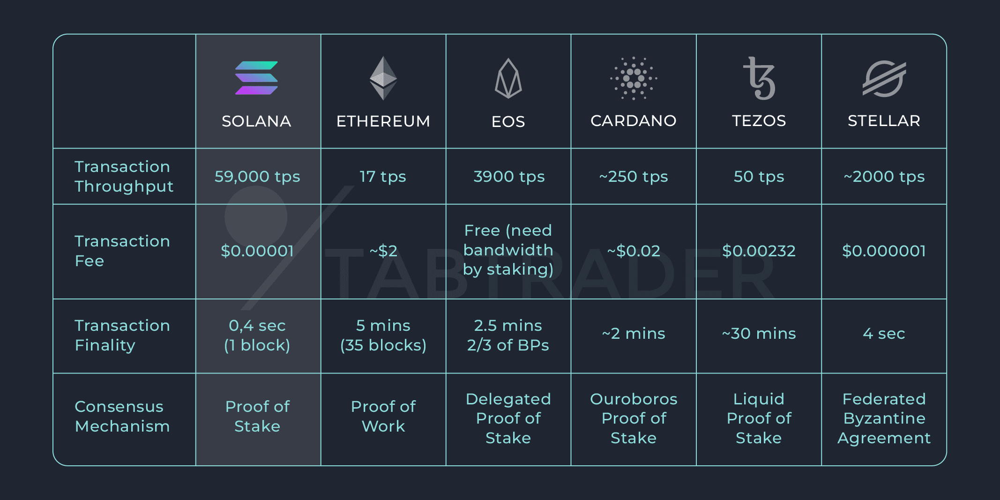

## Solana Ecosystem
---

### 1. How many validators are there currently?
> As of September 17, 2024, the Solana network had over 4,500 validators.

https://www.validators.app/
> Cluster
Software Version: 1.18.25  
Validators: 1410  
RPC nodes: 3213  
Total: 4533

### 2. What is special about this [block](https://explorer.solana.com/block/0)?

> Slot number: 0 -> First block / Genesis block  
Timestamp: 16 March 2020 -> Solana's mainnet launch date  
Epoch Number: 0 -> Initial block  

### 3. What is special about this [address](https://explorer.solana.com/address/1nc1nerator11111111111111111111111111111111)

> This is an incinerator address / burn address 
Designated to send tokens that permanently removed from the circulating supply

### 4. What is this [transaction](https://explorer.solana.com/tx/45pGoC4Rr3fJ1TKrsiRkhHRbdUeX7633XAGVec6XzVdpRbzQgHhe6ZC6Uq164MPWtiqMg7wCkC6Wy3jy2BqsDEKf) doing ?

This transaction doing token burning which sending it to the incinerator.
Fee payment paid by `account #1` to process the transaction

### What is the largest balance you can find in an account ?
Should be wallet associated with Solana Foundation.

### What advantages will the end user see when using Solana compared to other blockchains ?
